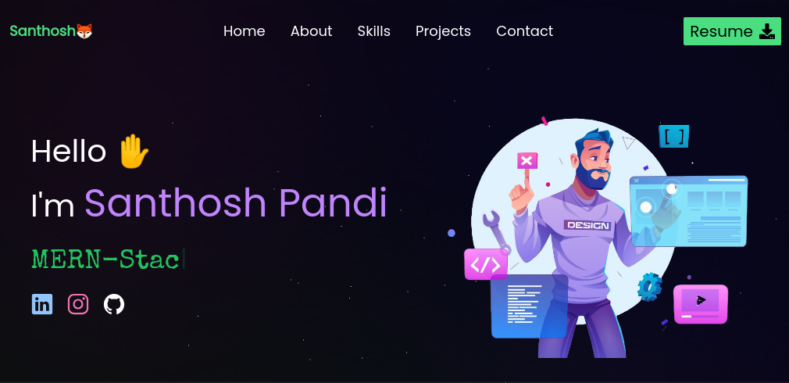
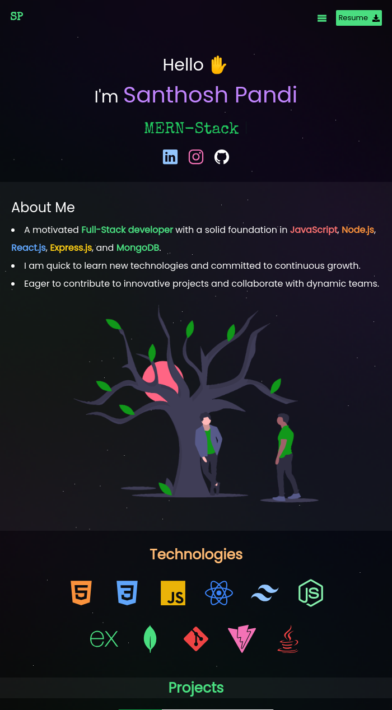

# My Portfolio

Welcome to my portfolio website👋! This site showcases my work, skills, and experience as a Developer. Feel free to browse through my projects and learn more about me.

## About
A portfolio website developed using React, Javascript, Tailwind, Vite. It is also a responsive website available for both pc and mobile. 

## Live Demo

Developed by Santhosh Pandi

[Live Demo👆](https://santhoshpandi.github.io/portfolio/)

## ScreenShots



## Features

- **Responsive Design**: The site is designed to be fully responsive, ensuring it looks great on any device, whether it's a desktop, or smartphone.
- **Projects**: A showcase of my most recent work and personal projects.
- **Skills**: A section where I highlight the programming languages, tools, and technologies I am proficient in.
- **Contact**: A contact form or my contact details for potential opportunities.

## Technologies Used

This portfolio was built using the following technologies:

- **React** : For structuring the content of the site.
- **TailwindCSS** : A utility-first CSS framework for custom styling.
- **GitHub Pages**: For hosting the portfolio site.

## Getting Started

To view or contribute to this project locally, follow these steps:

### 1. Clone the repository

  ```
  git clone https://github.com/santhoshpandi/portfolio.git
  ```
### 2. Move to the Directory
  ```
  cd portfolio
  ```
### 3. Install packages
  ```
  npm install
  ```
### 4. Start the Server
  ```
  npm run dev
  ```

  The website will be available at http://localhost:5173


